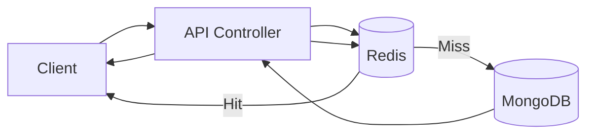

# Cache Aside Architecture

## High-Level Idea
Cache Aside means the application checks Redis first. If the data is missing, it loads from MongoDB, returns the result, and then stores a copy in Redis for the next request.

## How It Works
1. Client sends a `GET /api/cache-aside/todos` request.
2. Controller builds a cache key from the query string.
3. Redis is checked first.
4. If Redis has the data, the request ends immediately.
5. If Redis misses, MongoDB is queried.
6. MongoDB response is stored in Redis.
7. The API returns the MongoDB result.

## Diagram

## Best For
- Read-heavy endpoints
- Data that can tolerate short stale windows
- Frequently repeated queries

## Tradeoffs
- Simple and flexible
- Cache can become stale if writes do not invalidate it
- First request is always slower on a miss

## In This Project
- Route: `GET /api/cache-aside/todos`
- Cache key is derived from query params
- Redis stores the serialized todo list with a TTL
