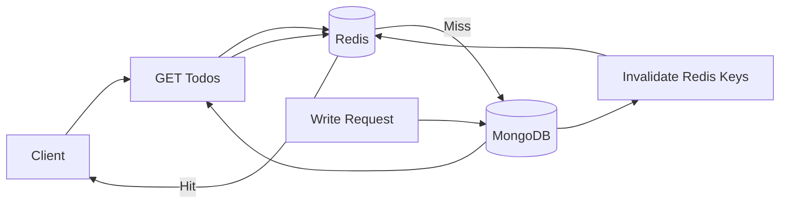

# Cache Invalidation Architecture

## High-Level Idea
Cache Invalidation keeps Redis and MongoDB aligned by deleting cached entries after a write. Reads still use the cache-first pattern, but writes actively clear outdated cache data.

## How It Works
1. Client reads data through `GET /api/cache-invalidation/todos`.
2. Controller checks Redis first.
3. If cache misses, MongoDB is queried and the result is cached.
4. On create, update, or delete, MongoDB is modified.
5. After the write, matching Redis keys are removed.
6. The next read repopulates Redis with fresh data.

## Diagram

## Best For
- Systems where freshness matters more than keeping stale cache entries
- Applications with frequent updates
- Data sets with multiple query-based cache keys

## Tradeoffs
- Keeps cache closer to source of truth
- Requires careful key cleanup
- Cache invalidation logic can grow complex as query patterns grow

## In This Project
- Route group: `/api/cache-invalidation`
- Create, update, and delete all invalidate `todos:*`
- The list endpoint repopulates Redis after invalidation
