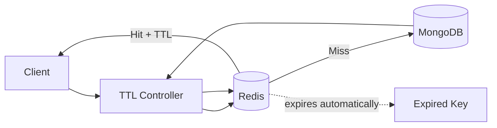

# TTL Cache Architecture

## High-Level Idea
TTL Cache stores fetched data in Redis with a fixed expiration time. Redis automatically removes the entry after the TTL expires, so stale data disappears without manual invalidation.

## How It Works
1. Client calls `GET /api/ttl-cache/todos`.
2. Controller generates a cache key from query params.
3. Redis is checked first.
4. If the key exists, the API returns cached data and the remaining TTL.
5. If the key is missing, MongoDB is queried.
6. MongoDB data is cached with `EX`.
7. Redis expires the key automatically after the TTL.

## Diagram

## Best For
- Data that can be slightly stale for a short time
- Simple read-heavy caching
- Cases where automatic cleanup is desirable

## Tradeoffs
- Very easy to reason about
- Staleness lasts until TTL ends
- The same query can be cached only for the lifetime of the key

## In This Project
- Route: `GET /api/ttl-cache/todos`
- TTL is set in `redis-strategies/ttl-cache/cache.js`
- The response includes remaining Redis TTL for visibility
