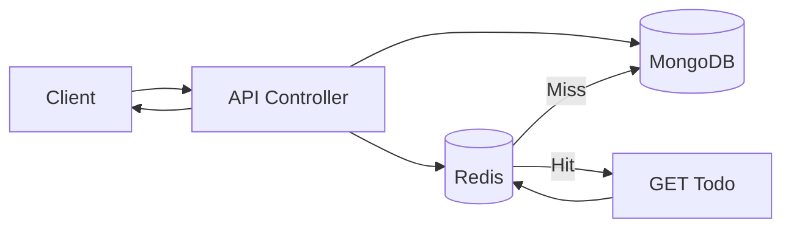

# Write Through Architecture

## High-Level Idea
Write Through updates Redis and MongoDB in the same request. The cache is written immediately, so reads can return from Redis without waiting for a later refresh.

## How It Works
1. Client creates or updates a todo.
2. API writes the change to MongoDB.
3. The same updated data is written to Redis.
4. Reads check Redis first.
5. Deletes remove the item from both MongoDB and Redis.

## Diagram

## Best For
- Workloads that need fresh cache immediately after writes
- Read-heavy systems with frequent item-level updates
- Predictable consistency between cache and database

## Tradeoffs
- Slightly slower writes because both stores are updated
- Simpler reads
- Cache and database should stay closely aligned

## In This Project
- Route group: `/api/write-through`
- `POST` and `PATCH` update both MongoDB and Redis
- `DELETE` removes the todo from both layers
