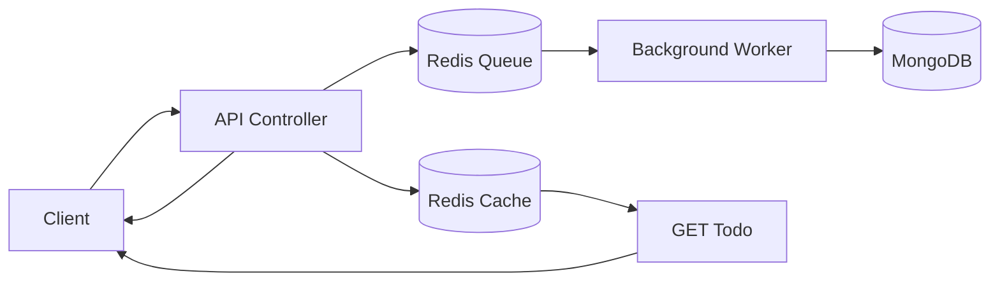

# Write Behind Architecture

## High-Level Idea
Write Behind stores new data in Redis first and pushes the database update to a background worker later. This makes the API feel fast, while MongoDB catches up asynchronously.

## How It Works
1. Client sends a create, update, or delete request.
2. API updates Redis immediately.
3. The operation is appended to a Redis queue.
4. A worker process listens to the queue.
5. The worker applies the change to MongoDB.
6. The client gets a fast response before the database write finishes.

## Diagram

## Best For
- High-write workloads where latency matters
- Systems that can tolerate eventual consistency
- Scenarios where background processing is acceptable

## Tradeoffs
- Fast user-facing writes
- Database can lag behind the cache
- Worker failure can cause queued operations to pile up

## In This Project
- Route group: `/api/write-behind`
- `cache.js` stores todo data and queue items in Redis
- `worker.js` reads the queue and persists changes to MongoDB
